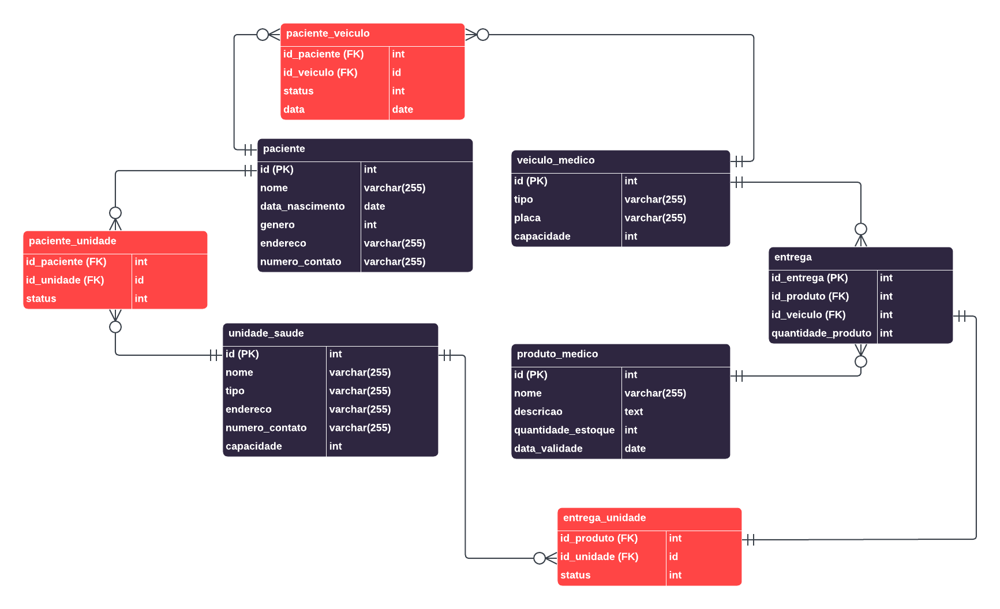
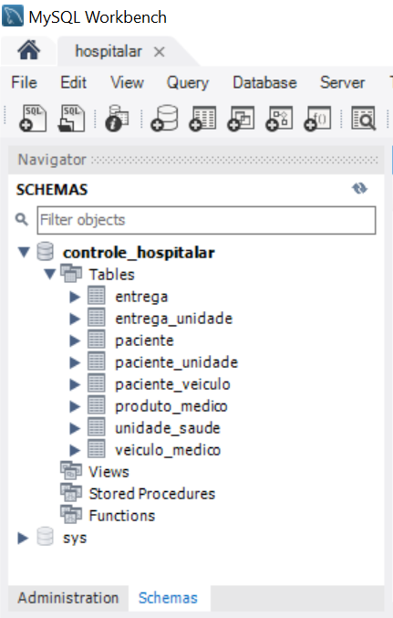
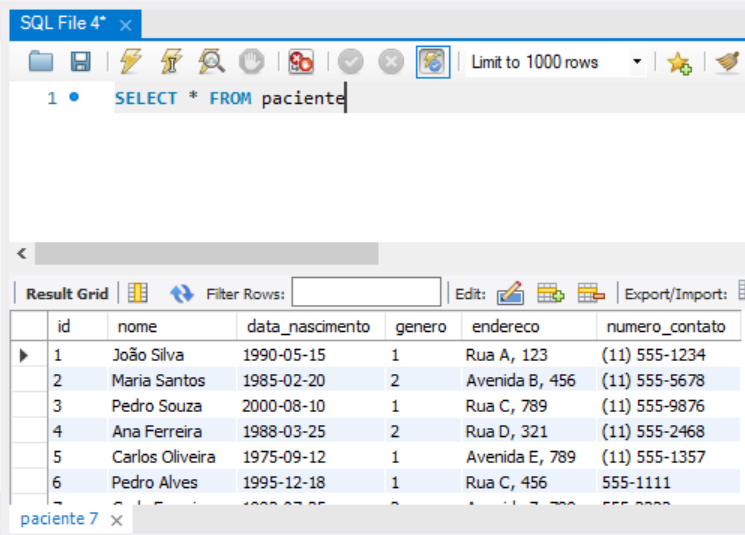
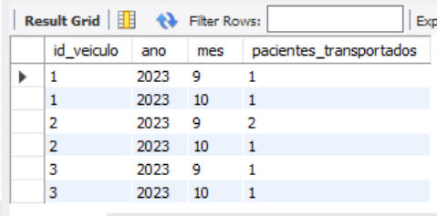
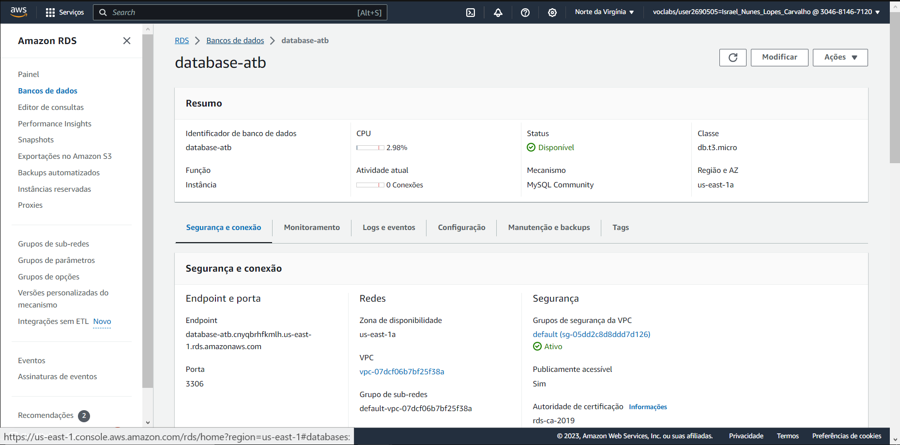

# Modelagem de bando de dados e deploy em nuvem
# Modelo lógico
O modelo lógico criado para solucionar a problemática foi o seguinte:

 

Este modelo foi depois criado em uma RDS.

# Criação das tabelas
O banco foi acessado pelo MySql Workbench, e queries como a seguinte foram utilizadas para criar as tabelas:
```sql
CREATE TABLE entrega (
    id_entrega INT PRIMARY KEY,
    id_produto INT,
    id_veiculo INT,
    quantidade_produto INT,
    FOREIGN KEY (id_produto) REFERENCES produto_medico(id),
    FOREIGN KEY (id_veiculo) REFERENCES veiculo_medico(id)
)
```
obs.:  "AUTO_INCREMENT UNIQUE" poderia ser adicionado ao campo id_entrega

<br>



Tabelas criadas

# Populando o banco de daos

Após criar as tabelas, o banco de dado foi populado utilizando queries como:

```sql
INSERT INTO paciente (id, nome, data_nascimento, genero, endereco, numero_contato)
VALUES
    (6, 'Pedro Alves', '1995-12-18', 1, 'Rua C, 456', '555-1111'),
    (7, 'Carla Ferreira', '1982-07-25', 2, 'Avenida Z, 789', '555-2222');
```
<br>



Banco de dados populado


# Paciente por mês
Através da query abaixo, é possível ter uma visão agrupada da quantidade de pacientes transportados por mês, por veículo.

```sql
SELECT
    veiculo.id AS id_veiculo,
    EXTRACT(YEAR FROM data) AS ano,
    EXTRACT(MONTH FROM data) AS mes,
    COUNT(paciente.id) AS pacientes_transportados
FROM
    paciente
JOIN paciente_veiculo ON paciente.id = paciente_veiculo.id_paciente
JOIN veiculo_medico AS veiculo ON paciente_veiculo.id_veiculo = veiculo.id
GROUP BY
    id_veiculo, ano, mes
ORDER BY
    id_veiculo, ano, mes;
```



Como pode ser observado, no mês 9, o veículo de id 2 transportou 2 pacientes.

# Acesso ao RDS

O RDS pode ser acessado pelo link *`database-atb.cnyqbrhfkmlh.us-east-1.rds.amazonaws.com:3306`* com o usuário `admin` e senha `admin123`.



RDS acessível
